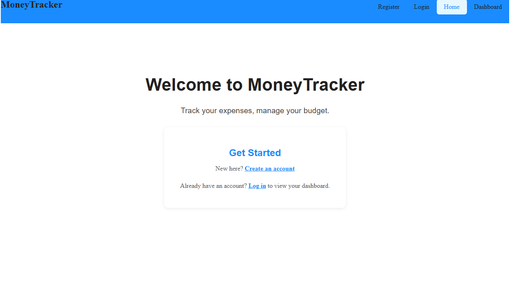
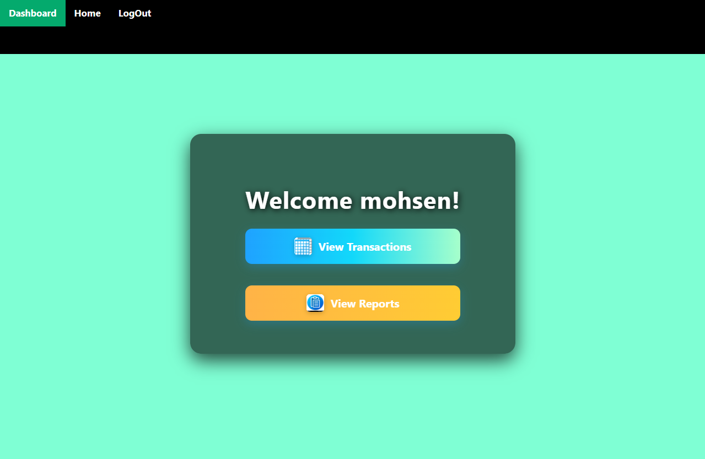
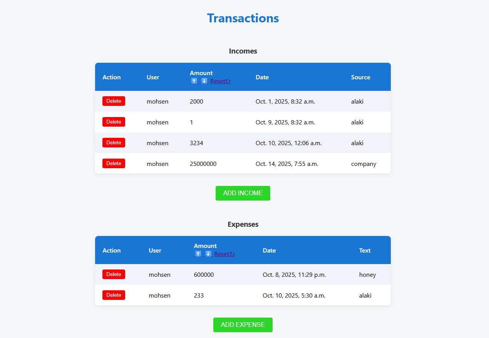
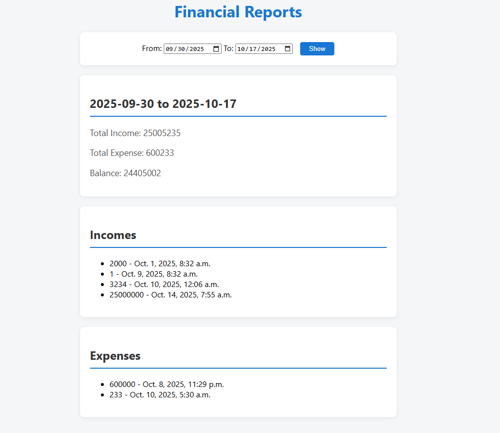
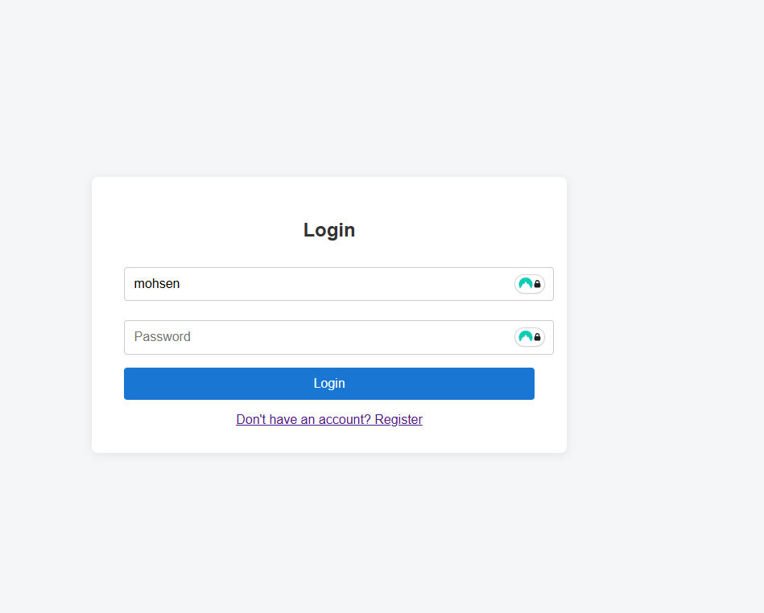

# MoneyTracker
یه اپ ساده برای مدیریت درآمد و هزینه‌های شخصیه. می‌تونی تراکنش‌ها رو ثبت کنی و موجودی و روند خرج و دخلت رو ببینی.

امکانات

ثبت درآمد و هزینه

دسته‌بندی تراکنش‌ها

مشاهده تاریخچه و موجودی  
## ابزارها:
python  
django  
django rest_framework  
sqlite

# نصب و اجرا
```bash
git clone <repo-url>
cd moneytracker
python -m venv env
source env/bin/activate   # لینوکس/مک
env\Scripts\activate      # ویندوز
pip install -r requirements.txt
python manage.py runserver
```


باز کردن در مرورگر:/http://127.0.0.1:8000

## screenshots






